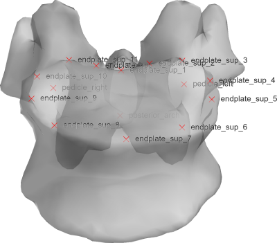

# 3D anatomical landmarks

This repository contains the code to process data in the "[3D anatomical landmarks](https://doi.org/10.57745/TJJLD6)" open dataset. The code automatically downloads the data from the repository.
 
The dataset contains 3D coordinates of anatomic landmarks of the spine, pelvis and lower limb of 813 healthy subjects. Landmarks were computed from the 3D reconstruction of bony structures obtained through biplanar radiography of participants in free-standing position.

## Getting started

You can start exploring "compute_sagittal_alignement.m", which shows how to compute vectors normal to vertebral endplate, thus allowing calculation of sagital parameters such as T1-T12 kyphosis or L1-L5 lordosis.

## Code description

* src/compute_sagittal_alignement.m : example of calculation of spinal sagittal parameters
* src/compute_axial_rotation.m : compute the axial orientation of key vertebrae (T8, T11, L2)
* src/plot_normalized_landmarks.m : plots all landmarks by dividing the cohort into three age groups (Age < 18, Age < 18, Age >= 50)

---
### License

3D anatomical landmarks  © 2026 by Claudio Vergari (Arts et Métiers, Paris, France) is licensed under CC BY-SA 4.0. 
To view a copy of this license, visit https://creativecommons.org/licenses/by-sa/4.0/